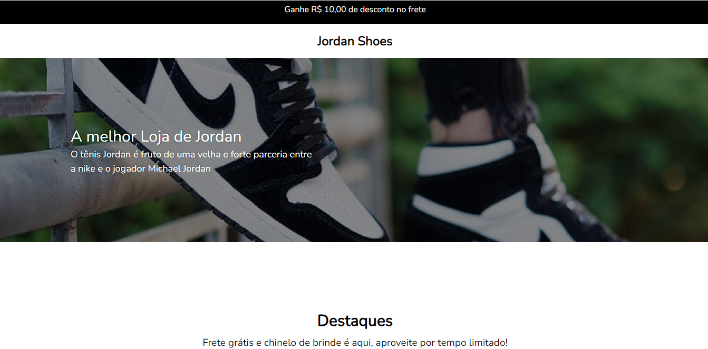
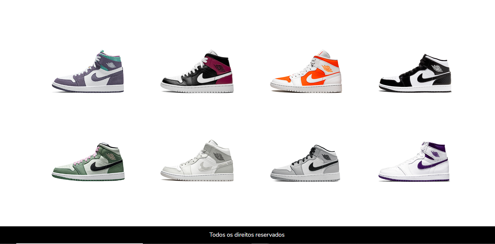

<h1 style='color: blue; font-family: sans-serif;'>Projeto Jordan Shoes</h1>

 

 O projeto é um mini-site de tênis da Jordan, fiz inspirado com base no projeto pronto do Codelândia no figma, e por fim, fiz algumas animações e usei um pouco de javascript para dar animação nas imagens dos calçados. Além disso, o projeto está 100% responsivo, adaptado para todos os tipos de tela 

  

 

